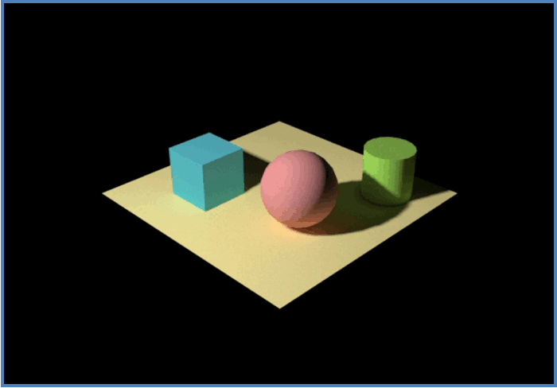

# 1.1. Rendering Overview

Rendering : 3D 모델링 된 이미지를 하나의 완성된 장면으로 만드는 프로세싱

<figure><figcaption></figcaption></figure>

### Rendering in Media & Entertainment

<figure><figcaption></figcaption></figure>

<figure><figcaption></figcaption></figure>

### Workflow of Production

<figure><figcaption></figcaption></figure>

### Rendering Process

<figure><figcaption></figcaption></figure>

<figure><figcaption></figcaption></figure>

<figure><figcaption></figcaption></figure>
