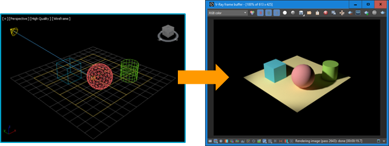

# 2.3. NICEDCV Setup

Cloudformation으로 배포한 리소스는 Windows 기본 계정인 Administrator로 설정되어 있습니다. 그러므로 기본 계정으로 설정된 DCV 세션을 제거하고 AD와 연동된 계정인 mystudio\Admin으로 세션을 재생성하고, 워크샵에 필요한 설치 파일을 FSx for Windows File Server에 저장하겠습니다.


1. 로컬 환경에서 AWS에 배포한 Workstation에 접속하기 위해 아래 링크에서 운영체제에 맞는 NICEDCV Client를 설치합니다.

> [https://download.nice-dcv.com/](https://download.nice-dcv.com/)

<figure><figcaption></figcaption></figure>

2. AWS EC2 콘솔에서 mystudioproject\workstation 체크 후 우상단의 연결 클릭\


<figure><figcaption></figcaption></figure>

3. **인스턴스에 연결 페이지가 나타나면, RDP 클라이언트 -> Fleet Manager를 사용하여 연결을 체크한 후 Fleet Manager 원격 데스크탑을 클릭합니다.**

<figure><figcaption></figcaption></figure>

4. Fleet Manager 로그인 설정 창이 나타나면, 사용자 자격증명을 체크한 후 사용자 이름과 암호를 입력하고 연결하기를 클릭합니다.\
   \
   **사용자 이름 : mystudio\Admin**\
   **암호 : Cloudformation에서 설정한 암호**

<figure><figcaption></figcaption></figure>

5. 원격 세션이 보이면, Command prompt를 관리자 권한으로 실행합니다.\


<figure><figcaption></figcaption></figure>

6. NICEDCV 설치 경로로 이동합니다.

```
cd “C:\Program Files\NICE\DCV\Server\bin”
```

7. 활성화 된 DCV 세션을 확인합니다.

```
dcv list-sessions
```

<figure><figcaption></figcaption></figure>

8. 활성화 된 세션은 Administrator 계정에 대해 생성되어 있습니다. 해당 세션을 제거합니다.

```
dcv close-session console
```

9. 세션이 제거되었는지 확인합니다.

```
dcv list-sessions
```

<figure><figcaption></figcaption></figure>

10. AD 계정에 대한 DCV 세션을 재생성합니다.

```
dcv create-session --owner mystudio\Admin --name “my graphic session” my-session
```

11. 세션이 생성되었는지 확인합니다.

```
dcv list-sessions
```

<figure><figcaption></figcaption></figure>

12. NICEDCV 클라이언트를 통해 생성한 DCV 세션에 로그인해보겠습니다. 설치한 DCV 클라이언트를 실행합니다.

<figure><figcaption></figcaption></figure>

13. AWS 콘솔에서 mystudioproject/workstation의 public IP 또는 public IPv4 DNS를 복사하고, DCV Client에 붙여넣습니다.

<figure><figcaption></figcaption></figure>

14. 로그인 정보를 입력하고, Login 버튼을 클릭합니다.

<figure><figcaption></figcaption></figure>

15. 다음 과정을 위해 몇가지 파일을 다운로드 하겠습니다. 접속한 원격 환경의 Firefox 브라우저를 통해 다운로드를 진행합니다.

***

#### **작업용 Workstation**

* **Blender**
  * &#x20;[https://www.blender.org/download/](https://www.blender.org/download/)
* **openGL**



#### 렌더 노드

* Snapd





***


16. 렌더 노드에 설치해야하는 snapd는 렌더 인스턴스에서 진행 될 예정이므로, 해당 파일을 다운로드하여 Z: 드라이브에 복사합니다.

<figure><figcaption></figcaption></figure>

17. 다음 과정에서 실습에 활용할 Blender를 Workstation과 Render Node에 설치해보도록 하겠습니다.

<figure><figcaption></figcaption></figure>

18.
